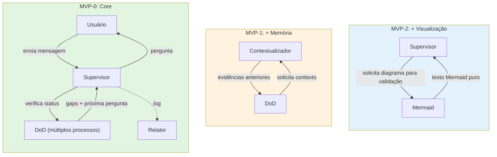
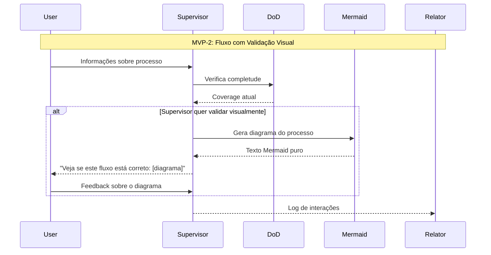
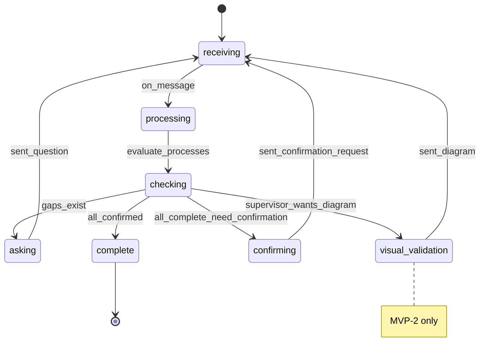

# agent-process-mapper

> Estudos sobre aplicabilidade prática de agentes de IA

# Agente Entrevistador - Versão Simplificada

Agente de IA para mapeamento de processos a partir de entrevistas automatizadas com colaboradores da empresa.

O sistema conduz entrevistas estruturadas, identifica lacunas, conecta informações já coletadas em outras entrevistas e organiza o conhecimento para posterior análise e uso.

---

## Sumário

* Escopo do Projeto
  * Supervisor
  * DoD (Definition of Done)
  * Contextualizador de Memória (MVP-1)
  * Mermaid (MVP-2)
  * Relator
* Fases de Implementação
* Valor do Projeto
* Riscos de Execução e Mitigações
* Estratégia de Implantação

---

## Escopo do Projeto

### Supervisor

* Orquestra a entrevista de múltiplos processos simultaneamente.
* Define a próxima melhor pergunta considerando:
  * Status de completude via DoD para cada processo.
  * Memória organizacional (quando Contextualizador estiver ativo no MVP-1).
* Evita redundâncias e mantém fluidez.
* Formato do speaker: "agent" ou "user:{nome_completo}"
* **Pode solicitar diagramas Mermaid** para validação com o entrevistado (MVP-2)

### DoD (Definition of Done)

* Define e acompanha a completude de CADA processo dentro da entrevista.
* Mantém uma base simples com:
  * Nome do processo
  * Status: **pendente**, **parcial** ou **completo**
  * Coverage: percentual de checkpoints concluídos
* **Único responsável** por solicitar resumos consolidados ao Contextualizador (quando ativo).
* Declara processo como completo quando:
  * `coverage >= min_coverage` (configurável, default 0.8)
  * Confirmação explícita do usuário (se requerida)

### Contextualizador de Memória Organizacional (MVP-1)

* **Ativo apenas a partir do MVP-1**
* Acessa base de entrevistas anteriores.
* Recuperação simples: `top-k = 10` por recência
* **Não decide sobre validação** - apenas fornece contexto quando solicitado pelo DoD

### Mermaid (MVP-2)

* **Ativo apenas a partir do MVP-2**
* Gera diagramas textuais Mermaid
* **Acionado exclusivamente pelo Supervisor** quando ele quer um desenho para validar com o entrevistado
* Gera apenas texto Mermaid válido (sem renderização nem outras informações de introdução ou encerramento)

### Relator

* Registra todas as mensagens da entrevista
* Log simplificado de eventos: "message_sent", "message_received", "process_completed"
* Garante rastreabilidade e auditabilidade
* Salva metadados essenciais: interview_id, timestamp, speaker

---

## Fases de Implementação

### MVP-0 (Core)
* ✅ Supervisor
* ✅ DoD com múltiplos processos
* ✅ Relator básico
* ❌ Sem Contextualizador
* ❌ Sem Mermaid
* ❌ Sem Vector Search

### MVP-1 (Memória)
* ✅ Adiciona Contextualizador simples
* ✅ Acesso a histórico de entrevistas anteriores

### MVP-2 (Visualização)
* ✅ Adiciona geração Mermaid
* ✅ Supervisor pode solicitar diagramas para validação

---

## Valor do Projeto

* Escalabilidade: entrevistas em grande escala com custo reduzido
* Consistência: cobertura de pontos obrigatórios sem omissões
* Múltiplos processos: mapeia vários processos em uma única entrevista
* Continuidade: usuário pode pausar e retomar de onde parou
* Rastreabilidade: histórico completo e auditável

---

## Riscos de Execução e Mitigações

### Complexidade Inicial
* Risco: over-engineering no MVP
* Mitigação: faseamento claro (MVP-0 → MVP-1 → MVP-2)

### Qualidade das perguntas
* Risco: roteiro superficial gera entrevistas pobres
* Mitigação: validação com especialistas antes do piloto

### Resistência cultural
* Risco: baixa confiança na IA
* Mitigação: começar com early adopters, comunicação clara

---

# Arquitetura Simplificada do Agente Entrevistador




## Estados Simplificados



## Regras Operacionais Simplificadas

### MVP-0
* DoD avalia múltiplos processos em paralelo
* Coverage calculado por processo: `checkpoints_ok / checkpoints_total`
* Processo completo quando: `coverage >= 0.8` E `confirmação = true` (se requerida)
* Relator registra apenas: mensagens + eventos básicos

### MVP-1
* Contextualizador acessa histórico completo de entrevistas
* Retorna top-10 mensagens mais relevantes/recentes
* Não toma decisões, apenas fornece contexto

### MVP-2
* Supervisor pode solicitar diagrama a qualquer momento
* Mermaid retorna APENAS texto do diagrama, sem introduções
* Usado para validação visual com o entrevistado

### Parâmetros
* `MIN_COVERAGE = 0.8` (configurável por processo)
* `REQUIRE_CONFIRMATION = true` (configurável por processo)
* `TOP_K = 10` (para Contextualizador no MVP-1)

# Contratos Simplificados

```
# Contratos de I/O Simplificados

## 1. receive_message
Entrada:
{
  "interview_id": "string",
  "message": "string", 
  "user_id": "string",
  "timestamp": "datetime"
}

Saída:
{
  "text_normalized": "string",
  "speaker": "user:{nome}" ou "agent"
}

## 2. check_processes (DoD)
Entrada:
{
  "interview_id": "string",
  "message": "string"
}

Saída:
{
  "processes": [
    {
      "process_key": "string",
      "coverage": 0.0-1.0,
      "status": "pendente|parcial|completo",
      "missing_items": ["item1", "item2"],
      "needs_confirmation": boolean
    }
  ]
}

## 3. get_context (Contextualizador - MVP-1)
Entrada:
{
  "query": "string",
  "interview_id": "string"
}

Saída:
{
  "evidences": [
    {
      "text": "string",
      "source": "interview_id",
      "timestamp": "datetime"
    }
  ]
}

## 4. generate_mermaid (Mermaid - MVP-2)
Entrada:
{
  "process_name": "string",
  "process_data": {}
}

Saída:
{
  "mermaid_text": "graph TD\n  A[Start] --> B[Step1]\n  B --> C[End]"
}
Nota: Retorna APENAS o texto Mermaid, sem explicações

## 5. decide_next_action (Supervisor)
Entrada:
{
  "processes": [array from check_processes],
  "wants_visual_validation": boolean
}

Saída:
{
  "action": "ask|confirm|show_diagram|complete",
  "target_process": "string",
  "content": "string" (pergunta ou diagrama Mermaid)
}

## 6. log_event (Relator)
Entrada:
{
  "interview_id": "string",
  "event_type": "message_sent|message_received|process_completed",
  "payload": {}
}

Saída:
{
  "logged": true
}
"""
```

# Estratégia de Implantação

## Fase 1: MVP-0 
* Deploy do core: Supervisor + DoD + Relator
* Testes

## Fase 2: MVP-1
* Adicionar Contextualizador
* Acesso a histórico completo de entrevistas
* Validar melhoria na qualidade das perguntas

## Fase 3: MVP-2
* Adicionar geração Mermaid
* Supervisor solicita diagramas para validação
* Mermaid retorna apenas texto puro do diagrama

---

## Considerações Finais

O sucesso de um projeto desse tipo depende de:
* **Foco no essencial**: começar simples e evoluir baseado em feedback
* **Múltiplos processos**: capacidade de mapear vários processos por entrevista
* **Validação visual**: usar diagramas Mermaid para confirmar entendimento, afinal, humanos são muito visuais
* **Iteração rápida**: ajustar baseado em uso real
